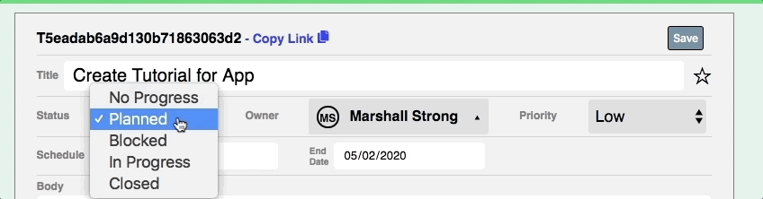
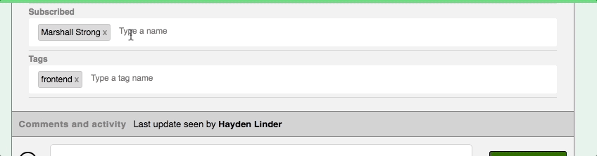
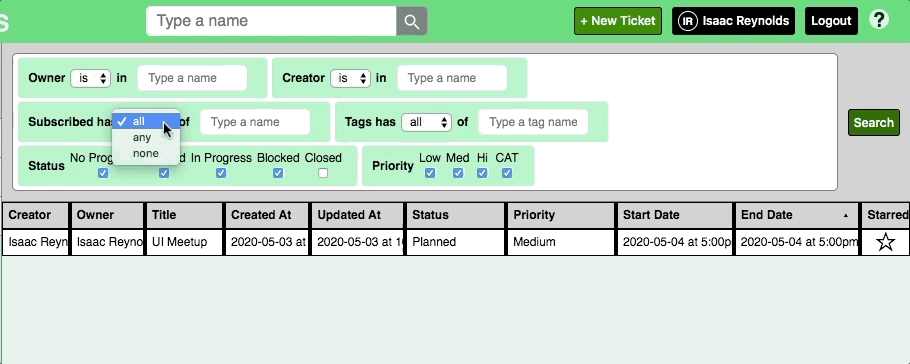

# Tickets

[Live Site](https://marshall-strong-tickets.herokuapp.com/)

Tickets is a productivity app that helps teams keep track of tasks.

The app is built using a MongoDB / Express / React / Node stack.

## Assign Status, Owner, Priority, and Due Date

- Let everyone know at a glance the ticket progress, who is responsible, and how urgent it is.

## Easily add Subscribers and Tags

- Want a team member kept in the loop? Add them to the subscribed section so that the ticket shows up in their Subscribed folder.

- Need to filter your tickets by custom categories? This is what tags are for.

## Build Complex Queries

- Easily find exactly the category of tickets you're looking for using a powerful but elegant interface.

