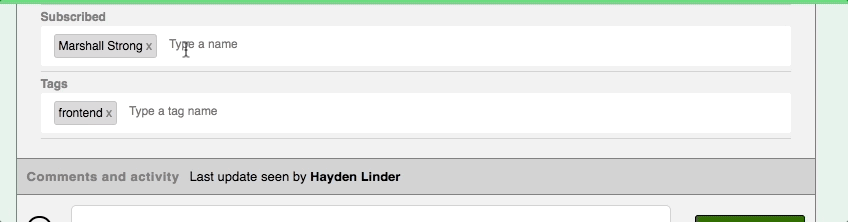
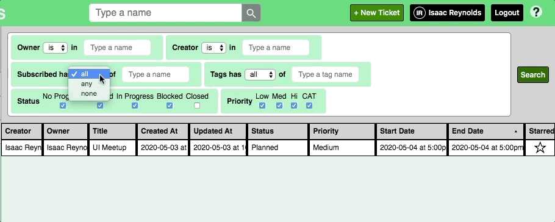

<a name="readme-top"></a>

<!-- PROJECT SHIELDS -->

[![Contributors][contributors-shield]][contributors-url]
[![Forks][forks-shield]][forks-url]
[![Stargazers][stars-shield]][stars-url]
[![Issues][issues-shield]][issues-url]
[![MIT License][license-shield]][license-url]
[![LinkedIn][linkedin-shield]][linkedin-url]

<!-- PROJECT TITLE & LOGO -->

<div align="center">
  <h1 align="center">TICKETS</h1>

  <!-- project logo -->
  <!--  -->

  <p align="center">
    a full-stack application for managing projects -- create tickets, assign and track work, and receive update notifications
    <br />
    <a href="https://marshall-strong-tickets.herokuapp.com/">View Demo Site</a>
    ·
    <a href="https://github.com/marshall-strong/tickets/issues">Report Bug</a>
    ·
    <a href="https://github.com/marshall-strong/tickets/issues">Request Feature</a>
  </p>
</div>

<!-- TABLE OF CONTENTS -->

<!-- While the README is still being updated, use the automatically generated ToC -->
<!-- Once the README is ready to be published, update and use the collapsable HTML ToC -->

- [About The Project](#about-the-project)
  - [Built With](#built-with)
- [Getting Started](#getting-started)
  - [1. Install Prerequisites](#1-install-prerequisites)
  - [2. Clone the GitHub Repository and Install Dependencies](#2-clone-the-github-repository-and-install-dependencies)
  - [3. Acquire an API Key (for Microsoft's Bing News Search API)](#3-acquire-an-api-key-for-microsofts-bing-news-search-api)
  - [4. Add the API Key to the Project](#4-add-the-api-key-to-the-project)
  - [5. Run the Project](#5-run-the-project)
- [Features](#features)
  - [Assign Status, Owner, Priority, and Due Date](#assign-status-owner-priority-and-due-date)
  - [Easily add Subscribers and Tags](#easily-add-subscribers-and-tags)
  - [Build Complex Queries](#build-complex-queries)
- [Project Style](#project-style)
  - [Pre-commit](#pre-commit)
  - [Prettier](#prettier)
  - [Stylelint](#stylelint)
- [Testing](#testing)
- [Production Deployment](#production-deployment)
- [Project Roadmap](#project-roadmap)
- [Contributing](#contributing)
- [License](#license)
- [Contact](#contact)
- [Acknowledgments](#acknowledgments)

<!-- <details>
  <summary>Table of Contents</summary>
  <ol>
    <li>
      <a href="#about-the-project">About The Project</a>
      <ul>
        <li><a href="#built-with">Built With</a></li>
      </ul>
    </li>
    <li>
      <a href="#getting-started">Getting Started</a>
      <ul>
        <li><a href="#prerequisites">Prerequisites</a></li>
        <li><a href="#installation">Installation</a></li>
      </ul>
    </li>
    <li><a href="#usage">Usage</a></li>
    <li><a href="#roadmap">Roadmap</a></li>
    <li><a href="#contributing">Contributing</a></li>
    <li><a href="#license">License</a></li>
    <li><a href="#contact">Contact</a></li>
    <li><a href="#acknowledgments">Acknowledgments</a></li>
  </ol>
</details> -->

<!-- ABOUT THE PROJECT -->

## About The Project

[![Project Screenshot][project-screenshot]][project-production-url]

This project is a productivity app that helps teams keep track of tasks.

A production deployment of this project can be viewed at [marshall-strong-tickets.herokuapp.com](https://marshall-strong-tickets.herokuapp.com/#/).

<p align="right">(<a href="#readme-top">back to top</a>)</p>

### Built With

<!-- The app is built using a MongoDB / Express / React / Node stack. -->

<!-- Amazon AWS, Amazon S3, Babel, Microsoft Bing New Search API, Create React App,
CSS3, ES6, ESLint, GitHub, Google Chrome, Heroku, HTML5, JavaScript, Markdown, Node.js, npm, PostgreSQL, pre-commit, Prettier, React Router, React, Redux, Ruby, Ruby on Rails, RubyGems, SCSS, stylelint, webpack -->

[![MongoDB][mongodb-shield]][mongodb-url] <!-- #47A248 -->

- MongoDB description...

[![Mongoose][mongoose-shield]][mongoose-url] <!-- #880000 -->

- Mongoose description...

[![Express][express-shield]][express-url] <!-- #000000 -->

- Express description...

[![React][react-shield]][react-url] <!-- #61DAFB -->

- React is an open-source front-end JavaScript library for building user interfaces based on UI components.

[![Redux][redux-shield]][redux-url] <!-- #764ABC -->

- Redux description...

[![Create React App][cra-shield]][cra-url] <!-- #09D3AC -->

- Create React App takes care of setting up and configuring a new React application with useful defaults, eliminating a lot of boilerplate code. It also integrates Jest and React-Testing-Library into the application, making it easy to setup unit tests down the road.

[![Node.js][nodedotjs-shield]][nodedotjs-url] <!-- #339933 -->

- Node.js description...

[![Amazon AWS][amazonaws-shield]][amazonaws-url] <!-- #232F3E -->

- Amazon AWS description...

[![AWS S3 Image Hosting][amazons3-shield]][amazons3-url] <!-- #569A31 -->

- AWS S3 Image Hosting description...

[![Heroku][heroku-shield]][heroku-url] <!-- #430098 -->

- Heroku description...

<p align="right">(<a href="#readme-top">back to top</a>)</p>

<!-- GETTING STARTED -->

## Getting Started

To set up and run a local copy of this project on your own machine, do the following:

### 1. Install Prerequisites

- install Ruby
- install Rails

- install Heroku local?

- Do the steps below have to take place in order to run the front end with CRA scripts?

Node.js is a back-end runtime environment that executes JavaScript code outside a web browser, and npm is its default package manager. Both must be installed locally in order to run this project.

- `Node.js`

  The recommended way of installing Node.js is with a Node version manager.
  Different operating systems use different Node version managers:

  _Node version managers for OSX and Linux:_

  - `nvm` - [installation instructions](https://github.com/creationix/nvm)
  - `n` - [installation instructions](https://github.com/tj/n)

  _Node version managers for Windows:_

  - `nodist` - [installation instructions](https://github.com/marcelklehr/nodist)
  - `nvm-windows` - [installation instructions](https://github.com/coreybutler/nvm-windows)

  Choose an appropriate Node version manager for your operating system and follow the installation instructions linked above to install both the version manager and Node.js.

  To confirm that Node.js has been installed successfully, run the following command to check the installed version:

  ```sh
  node -v
  ```

- `npm`

  Once Node.js is installed, download and install the latest version of npm by running the following command from the command line:

  ```sh
  npm install npm@latest -g
  ```

  To confirm that npm has been installed successfully, run the following command to check the installed version:

  ```sh
  npm -v
  ```

For additional information or help installing Node.js, npm, and Node version managers, consult the official npm documentation on [Downloading and installing Node.js and npm](https://docs.npmjs.com/downloading-and-installing-node-js-and-npm).

### 2. Clone the GitHub Repository and Install Dependencies

The GitHub repository for this project can be found at <https://github.com/marshall-strong/yenius>.

Click on the "Code" button and select which method to use to clone the repository: HTTPS, SSH, the GitHub CLI, or Download a ZIP file.

To clone the repository using the GitHub CLI, run the following command from the command line:

```sh
gh repo clone marshall-strong/yenius
```

Navigate into the project's root directory:

```sh
cd yenius
```

Install project dependencies:

```sh
npm install
```

### 3. Acquire an API Key (for Microsoft's Bing News Search API)

All of the images this site displays are retrieved from Pexels, and are requested and received via the Pexels API. An API key is required in order to interact with the Pexels API. **A Pexels API Key is NOT included in this repository -- you must get your own (free) API key from Pexels.**

Follow these steps to register with Pexels and obtain a Pexels API Key:

- Create a free Pexels account at <https://www.pexels.com/onboarding>
- Click the "I want to download" button
- Enter your personal information, then click the "Create New Account" button
- Complete your account setup by opening the email sent to you by Pexels and clicking the "Confirm email" button
- Go to <https://www.pexels.com/api/> and click the "Your API Key" button
- Fill out the form, agree to the Terms of Service, and click the "Generate API Key" button
- Copy the API key and save it somewhere safe -- you will need it in the next section

The API key should be a 56 character string of numbers and lowercase letters.

example: `sample0api0key123456789abcdefghijklmnopqrstuvwxyz0000000`

If you ever lose or misplace your API key, you can retrieve it by logging in to your Pexels account.

### 4. Add the API Key to the Project

In development mode, the Pexels API Key is stored in a `.env` file and saved as an environment variable. This `.env` file should NOT be committed to GitHub, and is not a secure way to store API keys in a production environment.

Create a new file named `.env` inside of the `react-frontend` sub-directory:

```sh
touch react-frontend/.env
```

Add your Pexels API Key to the `.env` file as an environmental variable named `PEXELS_API_KEY`:

```sh
echo "PEXELS_API_KEY=sample0api0key123456789abcdefghijklmnopqrstuvwxyz0000000" > react-frontend/.env
```

Once you are done, your `.env` file should look like this:

```js
// react-photo-search/react-frontend/.env

PEXELS_API_KEY = sample0api0key123456789abcdefghijklmnopqrstuvwxyz0000000;
```

The file `react-photo-search/react-frontend/example.env` is an example `.env` file with a fake API Key that you can use as a guide when creating your own `.env` file with your own API Key.

### 5. Run the Project

Start the project by running the `npm start` command from the root directory of the GitHub repository:

```sh
npm start
```

This command is a shortcut that uses Create React App's built-in scripts to start the development server and compile the project using webpack. At the same time, Netlify Dev starts another, separate server to load the Netlify Functions onto, and it makes the environment variables defined in the `.env` file available to the Netlify Functions server (but NOT to the Create React App server). Even in Development mode, this will hide the Pexels API key from users on the client side.

<p align="right">(<a href="#project_title">back to top</a>)</p>

<!-- USAGE EXAMPLES -->

<!-- ## Usage -->

<!-- Use this space to show useful examples of how a project can be used. Additional screenshots, code examples and demos work well in this space. You may also link to more resources.

_For more examples, please refer to the [Documentation](https://example.com)_ -->

## Features

### Assign Status, Owner, Priority, and Due Date

- Let everyone know at a glance the ticket progress, who is responsible, and how urgent it is.


### Easily add Subscribers and Tags

- Want a team member kept in the loop? Add them to the subscribed section so that the ticket shows up in their Subscribed folder.

- Need to filter your tickets by custom categories? This is what tags are for.



### Build Complex Queries

- Easily find exactly the category of tickets you're looking for using a powerful but elegant interface.



<p align="right">(<a href="#readme-top">back to top</a>)</p>

## Project Style

### Pre-commit

[Pre-commit](https://pre-commit.com/) is a framework for managing and maintaining multi-language pre-commit hooks. It runs Git hook scripts (like linters) before each Git commit, and prompts the user to fix any issues that are found before the commit can be saved. Pre-commit manages Git hooks for the user and allows them to use linters written in any language, regardless of which language the actual project is written in.

Before using Pre-commit on your machine for the first time, the Pre-commit package manager must first be installed locally on your machine:

```bash
#!/bin/bash
$ pip install pre-commit
```

Pre-commit hooks are configured using a file named `.pre-commit-config.yaml`. The file containing the Pre-commit configuration for this project is reproduced below:

```yaml
# yenius/.pre-commit-config.yaml

repos:
  - repo: https://github.com/pre-commit/pre-commit-hooks
    rev: v3.4.0
    hooks:
      - id: trailing-whitespace
      - id: end-of-file-fixer
      - id: check-yaml
      - id: check-added-large-files
  - repo: https://github.com/pre-commit/mirrors-prettier
    rev: "v2.7.1" # Note: Use the sha / tag you want to point at
    hooks:
      - id: prettier
  - repo: https://github.com/thibaudcolas/pre-commit-stylelint
    rev: "v14.10.0" # Note: Use the sha / tag you want to point at
    hooks:
      - id: stylelint
        args: [--fix]
        additional_dependencies:
          # Note: stylelint itself (and not a mirror) needs to be used here when using additional_dependencies.
          - stylelint@latest
          - stylelint-config-standard@latest
          - stylelint-config-idiomatic-order@latest
          - stylelint-config-prettier@latest
          # Note: Package names starting with `@` need to be quoted. For example:
          # - "@scope/my-awesome-plugin@0.12.0"
```

**Note:** The `prettier` and `stylelint` hooks configured in the `.pre-commit-config.yaml` file above are described in greater detail in the next section.

Once the configuration file is complete, run `pre-commit install` to set up the git hook scripts:

```sh
#!/bin/bash
$ pre-commit install
pre-commit installed at .git/hooks/pre-commit
```

Once installed, Pre-commit will run automatically on every `git commit`!

_Console output after installing and configuring pre-commit:_

```bash
#!/bin/bash
$ pip install pre-commit --upgrade
$ pre-commit --version
pre-commit 2.13.0
$ cd yenius
$ pre-commit sample-config
$ pre-commit install
pre-commit installed at .git/hooks/pre-commit
$ pre-commit run --all-files
```

[pre-commit/pre-commit-hooks](https://github.com/pre-commit/pre-commit-hooks) Some out-of-the-box hooks for pre-commit

### Prettier

[Prettier](https://prettier.io/) is an opinionated code formatter that enforces conventions automatically.

[prettier/prettier](https://github.com/prettier/prettier)
Official Prettier repository

[pre-commit/mirrors-prettier](https://github.com/pre-commit/mirrors-prettier)
Mirrors all prettier/prettier releases, used by Pre-commit to run the prettier hook

### Stylelint

[Stylelint](https://stylelint.io/) is a linter that identifies errors and enforces conventions in a project's stylesheets.

_Use `npx` to run Stylelint at any time (not just when saving a commit):_

```bash
#!/bin/bash
$ cd yenius
$ npx stylelint "react-frontend/src/**/*.css" --fix
```

[stylelint/stylelint](https://github.com/stylelint/stylelint)
Official Stylelint repository

[stylelint/stylelint-config-standard](https://github.com/stylelint/stylelint-config-standard)
The standard shareable config for Stylelint

[ream88/stylelint-config-idiomatic-order](https://github.com/ream88/stylelint-config-idiomatic-order)
Orders styles using consistent, idiomatic CSS

[prettier/stylelint-config-prettier](https://github.com/prettier/stylelint-config-prettier)
Turns off all rules that are unnecessary or might conflict with prettier

[thibaudcolas/pre-commit-stylelint](https://github.com/thibaudcolas/pre-commit-stylelint)
Mirrors all stylelint/stylelint releases, used by Pre-commit to run the stylelint hook

<p align="right">(<a href="#readme-top">back to top</a>)</p>

## Testing

There are not currently any tests -- they need to be added.

<!-- [**Jest**](https://jestjs.io/) is a JavaScript testing framework put out by Facebook and designed for unit testing React components.

This project has basic unit tests for each component -- [Add more Unit Testing with Jest](https://github.com/marshall-strong/yenius/issues/67) for all React components is part of the [Project Roadmap](#project-roadmap) for future development.

[**Playwright**](https://playwright.dev/) is a framework by Microsoft that enables reliable end-to-end testing for modern web apps.

This project does not currently have any end-to-end tests -- [Add End-to-End Testing with Playwright](https://github.com/marshall-strong/yenius/issues/68) is part of the [Project Roadmap](#project-roadmap) for future development.

### Running Unit Tests with Jest

To run this project's unit tests using Jest, run the following command:

```node
npm test
```

This project was built using Create React App, so Jest is already built into the app.
When `npm test` is run from the root directory, Node navigates into the React project subdirectory and runs Jest using `react-scripts test`.

At this point in time, the only Unit Tests for this project are basic smoke tests for each component. Part of the [Project Roadmap](#project-roadmap) for future development is to [add more robust unit testing](https://github.com/marshall-strong/yenius/issues/67) for all React components. -->

<!-- #### Jest Documentation

<https://jestjs.io/docs/tutorial-react>
<https://create-react-app.dev/docs/running-tests/#testing-components>
<https://reactjs.org/docs/testing-recipes.html> -->

<p align="right">(<a href="#readme-top">back to top</a>)</p>

## Production Deployment

**<http://marshall-strong-tickets.herokuapp.com/>**

This project is deployed to Production via Heroku.
A live version of the site can be viewed [here](http://marshall-strong-tickets.herokuapp.com/).

<p align="right">(<a href="#readme-top">back to top</a>)</p>

<!-- ROADMAP -->

## Project Roadmap

Plans for future development, testing, and features:

<!-- - [ ] [Add Server-Side Rendering with Next.js](https://github.com/marshall-strong/react-photo-search/issues/65)
- [ ] [Add Mobile Responsiveness](https://github.com/marshall-strong/react-photo-search/issues/66)
- [ ] [Add more Unit Testing with Jest](https://github.com/marshall-strong/react-photo-search/issues/67)
- [ ] [Add End-to-End Testing with Playwright](https://github.com/marshall-strong/react-photo-search/issues/68) -->

See the [open issues](https://github.com/marshall-strong/tickets/issues) for a full list of proposed features (and known issues).

<p align="right">(<a href="#readme-top">back to top</a>)</p>

<!-- CONTRIBUTING -->

## Contributing

Contributions are what make the open source community such an amazing place to learn, inspire, and create. Any contributions you make are **greatly appreciated**!

If you have a suggestion that would make this better, please fork the repo and create a pull request. You can also simply open an issue.

If you found this project helpful, don't forget to give it a star!

<p align="right">(<a href="#readme-top">back to top</a>)</p>

<!-- LICENSE -->

## License

Distributed under the MIT License. See `LICENSE.txt` for more information.

<p align="right">(<a href="#readme-top">back to top</a>)</p>

<!-- CONTACT -->

## Contact

Want to get in touch? Email me at <marshallstrong123@gmail.com> or reach out on [LinkedIn][linkedin-url].

Interesting in checking out some of the other projects I've worked on?

Visit [marshallstrong.com](https://marshallstrong.com/) for a full list, as well as my resume and work experience.

Thanks for reading!!!

<p align="right">(<a href="#readme-top">back to top</a>)</p>

<!-- ACKNOWLEDGMENTS -->

## Acknowledgments

- [pre-commit](https://pre-commit.com/)
  - runs Git hook scripts before each commit and prompts the user to fix any issues before the commit can be saved
- [Prettier](https://prettier.io/)
  - Automatically formats code and enforces style conventions
- [Stylelint](https://stylelint.io/)
  - Identifies errors and enforces conventions in a project's stylesheets
- [Shields.io](https://shields.io/)
  - Concise, consistent, and legible badges in SVG and raster format

Resources and How-Tos

- [Boxy SVG: A free, browser-based tool for editing SVG elements](https://boxy-svg.com/)
- [The Difference Between ALT text and Title text](https://blog.spotibo.com/difference-between-alt-text-and-title-text/)

<p align="right">(<a href="#readme-top">back to top</a>)</p>

<!-- END OF README -->

<!-- MARKDOWN REFERENCE STYLE IMAGE AND URL LINKS -->
<!-- https://www.markdownguide.org/basic-syntax/#reference-style-links -->

<!-- PROJECT SHIELDS -->

[contributors-shield]: https://img.shields.io/github/contributors/marshall-strong/tickets.svg?style=for-the-badge
[contributors-url]: https://github.com/marshall-strong/tickets/graphs/contributors
[forks-shield]: https://img.shields.io/github/forks/marshall-strong/tickets.svg?style=for-the-badge
[forks-url]: https://github.com/marshall-strong/tickets/network/members
[stars-shield]: https://img.shields.io/github/stars/marshall-strong/tickets.svg?style=for-the-badge
[stars-url]: https://github.com/marshall-strong/tickets/stargazers
[issues-shield]: https://img.shields.io/github/issues/marshall-strong/tickets.svg?style=for-the-badge
[issues-url]: https://github.com/marshall-strong/tickets/issues
[license-shield]: https://img.shields.io/github/license/marshall-strong/tickets.svg?style=for-the-badge
[license-url]: https://github.com/marshall-strong/tickets/blob/master/LICENSE.txt
[linkedin-shield]: https://img.shields.io/badge/-LinkedIn-black.svg?style=for-the-badge&logo=linkedin&colorB=555
[linkedin-url]: https://linkedin.com/in/marshall-strong

<!-- PROJECT TITLE & LOGO -->
<!-- TABLE OF CONTENTS -->
<!-- ABOUT THE PROJECT -->

[project-screenshot]: ./assets/readme/ticketsScreenshot-1200-627.png
[project-production-url]: http://marshall-strong-tickets.herokuapp.com/

<!-- Built With -->

[amazonaws-shield]: https://img.shields.io/badge/Amazon%20AWS-232F3E?style=for-the-badge&logo=amazonaws&logoColor=white
[amazonaws-url]: https://aws.amazon.com/
[amazons3-shield]: https://img.shields.io/badge/Amazon%20S3-569A31?style=for-the-badge&logo=amazons3&logoColor=white
[amazons3-url]: https://aws.amazon.com/s3/
[cra-shield]: https://img.shields.io/badge/Create%20React%20App-09D3AC?style=for-the-badge&logo=createreactapp&logoColor=white
[cra-url]: https://create-react-app.dev/
[express-shield]: https://img.shields.io/badge/Express-000000?style=for-the-badge&logo=express&logoColor=white
[express-url]: https://expressjs.com/
[heroku-shield]: https://img.shields.io/badge/Heroku-430098?style=for-the-badge&logo=heroku&logoColor=white
[heroku-url]: https://www.heroku.com/
[mongodb-shield]: https://img.shields.io/badge/MongoDB-47A248?style=for-the-badge&logo=mongodb&logoColor=white
[mongodb-url]: https://www.mongodb.com/
[mongoose-shield]: https://img.shields.io/badge/Mongoose-20232A?style=for-the-badge&logoColor=white&logo=data:image/svg+xml;base64,PD94bWwgdmVyc2lvbj0iMS4wIiBlbmNvZGluZz0iVVRGLTgiIHN0YW5kYWxvbmU9Im5vIj8+CjxzdmcgeG1sbnM6ZGM9Imh0dHA6Ly9wdXJsLm9yZy9kYy9lbGVtZW50cy8xLjEvIiB4bWxuczpjYz0iaHR0cDovL2NyZWF0aXZlY29tbW9ucy5vcmcvbnMjIiB4bWxuczpyZGY9Imh0dHA6Ly93d3cudzMub3JnLzE5OTkvMDIvMjItcmRmLXN5bnRheC1ucyMiIHhtbG5zOnN2Zz0iaHR0cDovL3d3dy53My5vcmcvMjAwMC9zdmciIHhtbG5zPSJodHRwOi8vd3d3LnczLm9yZy8yMDAwL3N2ZyIgeG1sbnM6c29kaXBvZGk9Imh0dHA6Ly9zb2RpcG9kaS5zb3VyY2Vmb3JnZS5uZXQvRFREL3NvZGlwb2RpLTAuZHRkIiB4bWxuczppbmtzY2FwZT0iaHR0cDovL3d3dy5pbmtzY2FwZS5vcmcvbmFtZXNwYWNlcy9pbmtzY2FwZSIgdmVyc2lvbj0iMS4xIiBpZD0ic3ZnMiIgeG1sOnNwYWNlPSJwcmVzZXJ2ZSIgd2lkdGg9IjEyODAiIGhlaWdodD0iNzQ2LjY2NjY5IiB2aWV3Qm94PSIwIDAgMTI4MCA3NDYuNjY2NjkiIHNvZGlwb2RpOmRvY25hbWU9Im1vbmdvb3NlLnN2ZyIgaW5rc2NhcGU6dmVyc2lvbj0iMS4wLjEgKDEuMC4xK3I3NSkiPgogIDxtZXRhZGF0YSBpZD0ibWV0YWRhdGE4Ij4KICAgIDxyZGY6UkRGPgogICAgICA8Y2M6V29yayByZGY6YWJvdXQ9IiI+CiAgICAgICAgPGRjOmZvcm1hdD5pbWFnZS9zdmcreG1sPC9kYzpmb3JtYXQ+CiAgICAgICAgPGRjOnR5cGUgcmRmOnJlc291cmNlPSJodHRwOi8vcHVybC5vcmcvZGMvZGNtaXR5cGUvU3RpbGxJbWFnZSIvPgogICAgICA8L2NjOldvcms+CiAgICA8L3JkZjpSREY+CiAgPC9tZXRhZGF0YT4KICA8ZGVmcyBpZD0iZGVmczYiPgogICAgPGNsaXBQYXRoIGNsaXBQYXRoVW5pdHM9InVzZXJTcGFjZU9uVXNlIiBpZD0iY2xpcFBhdGgyMiI+CiAgICAgIDxwYXRoIGQ9Ik0gMCw1NjAgSCA5NjAgViAwIEggMCBaIiBpZD0icGF0aDIwIi8+CiAgICA8L2NsaXBQYXRoPgogIDwvZGVmcz4KICA8c29kaXBvZGk6bmFtZWR2aWV3IHBhZ2Vjb2xvcj0iI2ZmZmZmZiIgYm9yZGVyY29sb3I9IiM2NjY2NjYiIGJvcmRlcm9wYWNpdHk9IjEiIG9iamVjdHRvbGVyYW5jZT0iMTAiIGdyaWR0b2xlcmFuY2U9IjEwIiBndWlkZXRvbGVyYW5jZT0iMTAiIGlua3NjYXBlOnBhZ2VvcGFjaXR5PSIwIiBpbmtzY2FwZTpwYWdlc2hhZG93PSIyIiBpbmtzY2FwZTp3aW5kb3ctd2lkdGg9IjIyMjciIGlua3NjYXBlOndpbmRvdy1oZWlnaHQ9IjEyMDUiIGlkPSJuYW1lZHZpZXc0IiBpbmtzY2FwZTpkb2N1bWVudC1yb3RhdGlvbj0iMCIgc2hvd2dyaWQ9ImZhbHNlIiBpbmtzY2FwZTp6b29tPSIwLjg1NzAzMTI1IiBpbmtzY2FwZTpjeD0iNTI4LjgwMjE5IiBpbmtzY2FwZTpjeT0iMzczLjMzMzM0IiBpbmtzY2FwZTp3aW5kb3cteD0iMjQiIGlua3NjYXBlOndpbmRvdy15PSIxMzIiIGlua3NjYXBlOndpbmRvdy1tYXhpbWl6ZWQ9IjAiIGlua3NjYXBlOmN1cnJlbnQtbGF5ZXI9ImcxOCIvPgogIDxnIGlkPSJnMTAiIGlua3NjYXBlOmdyb3VwbW9kZT0ibGF5ZXIiIGlua3NjYXBlOmxhYmVsPSJGSVZFUlJNT05HT09TRSIgdHJhbnNmb3JtPSJtYXRyaXgoMiwwLDAsLTIsLTM0MCwxMDAwKSI+CiAgICA8ZyBpZD0iZzEyIiB0cmFuc2Zvcm09InRyYW5zbGF0ZSg0MzkuODk5OSwyNDUuMzMzKSI+CiAgICAgIDxwYXRoIGQ9Im0gMCwwIC0yMy45LDM3LjExNyB2IC02Ni40NSBoIDQ2LjQwMyBsIDEuNTk3LDEuNjM2IHYgNjQuODE0IHoiIHN0eWxlPSJmaWxsOiM4ODAwMDA7ZmlsbC1vcGFjaXR5OjE7ZmlsbC1ydWxlOm5vbnplcm87c3Ryb2tlOm5vbmUiIGlkPSJwYXRoMTQiLz4KICAgIDwvZz4KICAgIDxnIGlkPSJnMTYiPgogICAgICA8ZyBpZD0iZzE4IiBjbGlwLXBhdGg9InVybCgjY2xpcFBhdGgyMikiPgogICAgICAgIDxnIGlkPSJnMjQiIHRyYW5zZm9ybT0idHJhbnNsYXRlKDY2Mi4xMTMzLDM5MS44OTc5KSI+CiAgICAgICAgICA8cGF0aAogICAgICAgICAgICBkPSJNIDAgMCBjIC05LjA2NyAtMC42NzYgLTE4LjE1NSAtMS4zNzYgLTI3LjI0IC0xLjQyOSBjIC01LjU5MiAtMC4wMzIgLTExLjI4IDAuNjk4IC0xNi43NjYgMS44MzkgYyAtNi45MzIgMS40NDMgLTEyLjc1OCA0Ljg3OCAtMTYuMTg2IDExLjU4MiBjIC0wLjUxIDAuOTkzIC0yLjIxNyAxLjU2NSAtMy40ODQgMS45NDMgYyAtNC40NjggMS4zMjggLTguOTg2IDIuNDg1IC0xMy40OTggNC4xNTQgYyAxLjU3IDAuMTE4IDMuMTQxIDAuMzQ2IDQuNzA4IDAuMzMgYyAzLjg0NiAtMC4wMzggNy43MzUgMC4xNDIgMTEuNTIyIC0wLjM2NiBjIDYuOTIxIC0wLjkyOCAxMy43ODcgLTIuMjggMjAuNjczIC0zLjQ3NSBjIDMuOTI0IC0wLjY4MiA3Ljg2OSAtMS4yOTYgMTEuNzYxIC0yLjEzMyBjIDcuMzg1IC0xLjU4OSAxNC43NDQgLTMuMjk4IDIyLjEwNiAtNC45ODkgQyAtMS41MzkgNi4zMzkgMy4zMTUgNS4xODIgOC4xNjggNC4wMDcgTSAxLjc2OSAtNDkuMTYxIGMgLTExLjMwOCAtMy40ODUgLTIyLjc0MiAtNi42MiAtMzMuODYxIC0xMC42MyBjIC02Ljk2MSAtMi41MTEgLTEzLjUwMiAtNi4yMyAtMjAuMTIgLTkuNjI2IGMgLTUuNzcgLTIuOTU4IC03LjgxMSAtOC4wMDkgLTcuMTAzIC0xNC4yOCBjIDAuNDU3IC00LjAyOSAxLjAwOSAtOC4wNDcgMS4zNzEgLTEyLjEzMyBjIC0yLjk1NyA0LjM2MyAtNS4xNDEgOS4wODIgLTYuNDI0IDE0LjIxOCBjIC0wLjI2NCAxLjA2MiAtMC41MTUgMi4xMjggLTAuNzM3IDMuMiBjIC0wLjg3NCA0LjE4MyAxLjQ0NiA2Ljc4NyA0LjQ3NiA5LjA1NSBjIDUuODk3IDQuNDE1IDEyLjMyIDcuODkyIDE5LjI5MiAxMC4yMDUgYyA4LjY5NiAyLjg4NyAxNy40MTkgNS43NjggMjYuMjg0IDguMDU3IGMgNi4yNDUgMS42MSAxMi43NDUgMi4yMjMgMTkuMTI3IDMuMzA0IGMgMS4xNzggMC4yMDIgMi4zMzcgMC41MiAzLjUwNSAwLjc4MiBjIDAuMDM5IC0wLjE2IDAuMDc5IC0wLjMyMSAwLjEyIC0wLjQ4MSBjIC0xLjk3NyAtMC41NTQgLTMuOTcgLTEuMDY2IC01LjkzIC0xLjY3MSBtIC0xNTkuNDU0IDQ0Ljc0NCBjIC0wLjE4NiAtMC4xODIgLTAuMzc1IC0wLjM2MiAtMC41NjMgLTAuNTQyIGMgLTUuMDQyIDMuNjc3IC0xMC41MTQgNi40MTUgLTE2LjUxIDguMDAzIGMgLTAuMTY4IC0wLjE2MyAtMC4zMzIgLTAuMzI2IC0wLjQ5NiAtMC40OSBjIDUuMTYxIC02LjA0OCAxMC4zMjMgLTEyLjA5NiAxNS43MSAtMTguNDA0IGMgLTMuNjA3IDEuMTggLTYuOTY0IDIuMjggLTEwLjMyMiAzLjM3OSBjIC0wLjE0MyAtMC4xNjkgLTAuMjg0IC0wLjMzOSAtMC40MjggLTAuNTA4IGMgNC4wNjMgLTYuNjk0IDkuMzUzIC0xMi41MSAxNC4zOTYgLTE5LjIyIGMgLTguNzY4IDQuOTc5IC0xNi41MDcgMTAuNDE3IC0yMy43MzEgMTYuNTk1IGMgLTkuOTE2IDguNDgxIC0xOC41NjYgMTguMDQ3IC0yNS4wNDYgMjkuNDM5IGMgLTIuNjY5IDQuNjk0IC01LjAyNSA5LjU1IC01LjUyOSAxNS4wNDMgYyAtMC4xMTMgMS4yMjYgLTAuMDE1IDIuNTIzIDAuMjcxIDMuNzIgYyAwLjQ2NSAxLjk0MyAyLjMwOSAyLjg0IDQuMjAyIDIuMjUyIGMgMTAuNCAtMy4yMzMgMjAuNjIyIC02Ljg5NiAzMC4xODkgLTEyLjIxMSBjIDkuMDU2IC01LjAzMSAxNy4yNTIgLTExLjE1MyAyNC4zMDMgLTE4Ljc2OSBjIDAuMjg1IC0wLjMwOCAwLjQ5NiAtMC42ODQgMC44ODkgLTEuMjM2IGMgLTUuNTIxIDIuNTE2IC0xMC43NiA0LjkwMiAtMTYgNy4yODkgYyAtMC4xNzcgLTAuMjE3IC0wLjM1MyAtMC40MzUgLTAuNTMyIC0wLjY1MyBjIDMuMDY3IC00LjU2MiA2LjEzMiAtOS4xMjUgOS4xOTcgLTEzLjY4NyBtIC0zMTUuMzcyIC01NS4zMTggYyAtMC4xMyAtMC4zNTMgMC4yNzYgLTAuNyAwLjQxNCAtMS4wNDkgYyAyLjE1NiAwLjQ1MyA0LjI5MyAxLjA0NSA2LjQ3IDEuMzM5IGMgMC41NjggMC4wNzUgMS4xMzYgMC4xNDcgMS43MDUgMC4yMjMgYyA4LjAzNCAyLjg2MyAxNi4yNjQgNS4xMTIgMjQuNzYyIDYuMzEgYyAxMi4wMTEgMS42OTEgMjQuNDYzIDMuOTM2IDM2LjcyMiAzLjg3IGMgMTEuNjQ4IC0wLjA1OSAyMy40MzEgLTEuODQzIDM0LjgyOCAtMy44MDggYyAzLjE5NyAtMC41NSA2LjMzNiAtMS4yODggOS40MyAtMi4xNTggYyA4LjMyNiAtMS44NjkgMTYuMTUgLTUuMjAzIDIzLjE4MiAtOS43MDkgYyAwLjUwNyAtMC4yNDIgMSAtMC41MDkgMS41MDIgLTAuNzYzIGMgOS45OTggLTQuNzEgMTguODA3IC0xMS42MzkgMjUuNzYzIC0yMC4xMjggYyAxLjI3MyAtMS40MDkgMy40OTIgLTIuODc4IDQuNjI5IC00LjQyIGMgMi4zOTYgLTIuODI3IDMuNTM3IC01LjgzOSA3LjUzNyAtOC45OTYgdiA0My4xMjYgaCA0OS44OCBsIDIzLjMyMyAtNDMuMDM2IGwgMjMuMzkyIDQzLjAzNiBoIDUxLjQwNSB2IC04My4zNTEgbCA4LjUwOSA1LjYxMSBjIDAgMCA5LjMzIDI0LjgwNiA1Mi41NTYgMjguMjg5IGwgNDkuNTQ0IDEuNjAyIGMgLTcuNjQyIDE1LjgxOSAtNy42MTQgMTUuODE5IC0zLjkyOSAyMC41OTEgYyAzLjY0OSA0LjcyMiAzMS43OTIgNy44MTggMzYuNzQyIDEwLjc3MSBsIDcyLjI5NyAxNC41ODcgYyAwLjE3IDAuNTU2IDAuMzYzIC0wLjI5OCAwLjczNiAtMC4xODEgYyAxLjc5OSAwLjU2NyAzLjY2MyAwLjkyNCA2LjIzMyAxLjUyOSBsIDE2LjM1IDMuOTc5IGMgMS4wNjQgMC41OTkgMi4zMzEgMC44MzYgMy41MDQgMS4yNDIgYyA3LjY0IDIuNjUyIDE0LjMyMSA2LjA2OCAxOC4wMTggMTQuMjA4IGMgMy42IDcuOTMgOC40MjEgMTUuMjk2IDEwLjE2OSAyNC4wMTggYyAwLjU1MSAyLjc1OSAwLjA3NiA1LjE1NyAtMS45MTUgNy4xNCBjIC0yLjQwOSAyLjM5OCAtNS41MTYgMy40MjggLTguNzE1IDQuMjU5IGMgLTEwLjQ0NCA0LjI4NyAtMjAuODUgOC42NzYgLTMxLjM3OSAxMi43NDcgYyAtNi40NzMgMi41MDQgLTEzLjExNCA0LjU4MiAtMTkuNzI0IDYuNzEgYyAtNi41NCAyLjEwNSAtMTMuMTE3IDQuMDkyIC0xOS43MTEgNi4wMTkgYyAtNi4wNzQgMS43NzcgLTEyLjE4NSAzLjQyOSAtMTguMjg4IDUuMDk0IGMgLTUuOTU0IDEuNjI0IC0xMS45IDMuMjk1IC0xNy44OTIgNC43NjcgYyAtNi45ODEgMS43MTYgLTE0LjAxIDMuMjQzIC0yMS4wMiA0Ljg0NSBjIC01LjMyNCAxLjIxNyAtMTAuNjI4IDIuNTE5IC0xNS45NzcgMy42MDggYyAtNS44MjUgMS4xODYgLTExLjY4NyAyLjIwNiAtMTcuNTQzIDMuMjM3IGMgLTcuNDggMS4zMTUgLTE0Ljk0NCAyLjc3MyAtMjIuNDY2IDMuNzk3IGMgLTkuMDgzIDEuMjM2IC0xOC4yMjQgMi4wMzYgLTI3LjMzMiAzLjEwOSBjIC0xNS4yNSAxLjc5OCAtMzAuNTQgMi4yOCAtNDUuODM5IDEuMTExIGMgLTUuNDIyIC0wLjQxNCAtMTAuNzcxIC0xLjc4OCAtMTYuMTUyIC0yLjcyMiBjIDUuNyAtMi45MjkgMTEuMzQgLTUuMjk4IDE2LjkwMyAtNy44MzQgYyA1LjU5NiAtMi41NTEgMTAuODEzIC01Ljc0OCAxNS42MDQgLTkuNjA3IGMgLTYuMjY5IDIuNCAtMTIuMzY4IDUuMTY4IC0xOC42NTUgNy40MTMgYyAtMTMuMTIxIDQuNjg0IC0yNi40NyA4LjU3NCAtNDAuMzMzIDEwLjQ1IGMgLTYuNzgxIDAuOTE3IC0xMy41NDUgMS43OTcgLTIwLjMyIC0wLjExNSBjIC02Ljg2NyAtMS45MzggLTguODA5IC00LjQ4NiAtOS40MzEgLTExLjM3NyBjIC0xLjAzIC0xMS40MjIgMi40MDcgLTIyLjAxNiA2Ljk3MiAtMzIuMjMxIGMgNi44MDcgLTE1LjIzMiAxNi43MjggLTI4LjIwNyAyOS40MTQgLTM5LjA1NyBjIDkuNzE0IC04LjMxMSAyMC40OTIgLTE0Ljg2MSAzMi4zOTggLTE5LjUzMSBjIDMuMzkxIC0xLjMzIDYuODE1IC0yLjU3OSAxMC4yMjEgLTMuODY2IGMgLTAuMDc3IC0wLjI2NSAtMC4xNTQgLTAuNTI3IC0wLjIzMSAtMC43OTMgYyAtNi41MjggMS43ODggLTEzLjIyMSAzLjEyOCAtMTkuNTQ0IDUuNDY2IGMgLTExLjE4MyA0LjEzMyAtMjEuMTgzIDEwLjQ0NyAtMzAuMzMyIDE4LjExNSBjIC0xMC4yMTIgOC41NjEgLTE4LjY5OSAxOC41NjYgLTI1LjAwNyAzMC4yODkgYyAtNi42OTQgMTIuNDM5IC0xMC41MjUgMjUuNzMgLTEwLjY2MyAzOS45NTUiCiAgICAgICAgICAgIHN0eWxlPSJmaWxsOiM4ODAwMDA7ZmlsbC1vcGFjaXR5OjE7ZmlsbC1ydWxlOm5vbnplcm87c3Ryb2tlOm5vbmUiCiAgICAgICAgICAgIGlkPSJwYXRoMjYiLz4KICAgICAgICA8L2c+CiAgICAgICAgPGcgaWQ9ImcyOCIgdHJhbnNmb3JtPSJ0cmFuc2xhdGUoMTg5LjAzMDgsMzMxLjY2NikiPgogICAgICAgICAgPHBhdGggZD0iTSAwLDAgQyAwLDAgMTE1Ljk2OSwxMTIgMjQ4LjUsOTguMSIgc3R5bGU9ImZpbGw6Izg4MDAwMDtmaWxsLW9wYWNpdHk6MTtmaWxsLXJ1bGU6bm9uemVybztzdHJva2U6bm9uZSIgaWQ9InBhdGgzMCIvPgogICAgICAgIDwvZz4KICAgICAgPC9nPgogICAgPC9nPgogIDwvZz4KPC9zdmc+
[mongoose-url]: https://mongoosejs.com/
[nodedotjs-shield]: https://img.shields.io/badge/Node.js-339933?style=for-the-badge&logo=nodedotjs&logoColor=white
[nodedotjs-url]: https://nodejs.org/
[react-shield]: https://img.shields.io/badge/React-61DAFB?style=for-the-badge&logo=react&logoColor=black
[react-url]: https://reactjs.org/
[redux-shield]: https://img.shields.io/badge/Redux-764ABC?style=for-the-badge&logo=redux&logoColor=white
[redux-url]: https://redux.js.org/

<!-- GETTING STARTED -->
<!-- USAGE EXAMPLES -->
<!-- ROADMAP -->
<!-- CONTRIBUTING -->
<!-- LICENSE -->
<!-- CONTACT -->
<!-- ACKNOWLEDGMENTS -->
